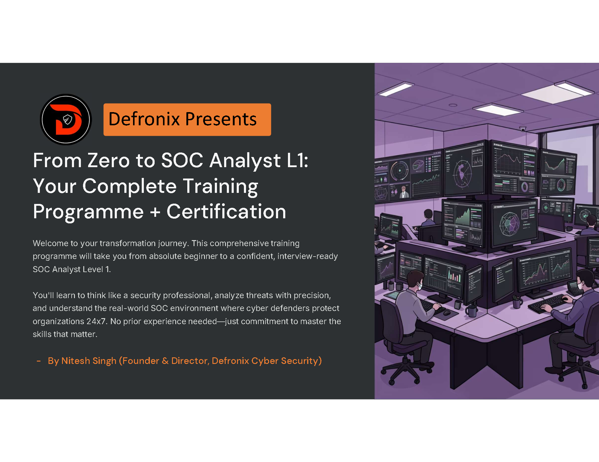
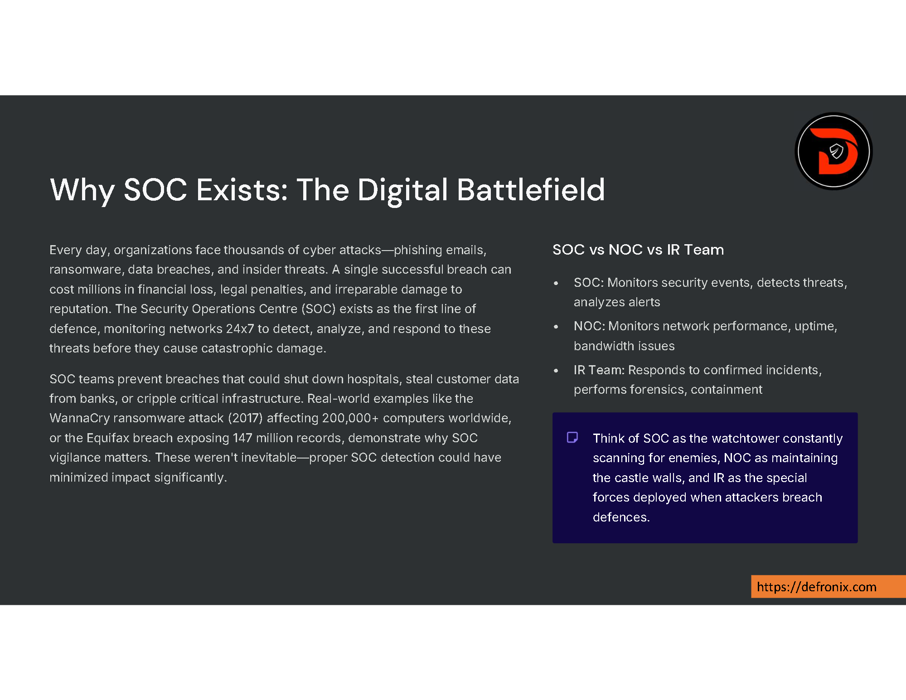
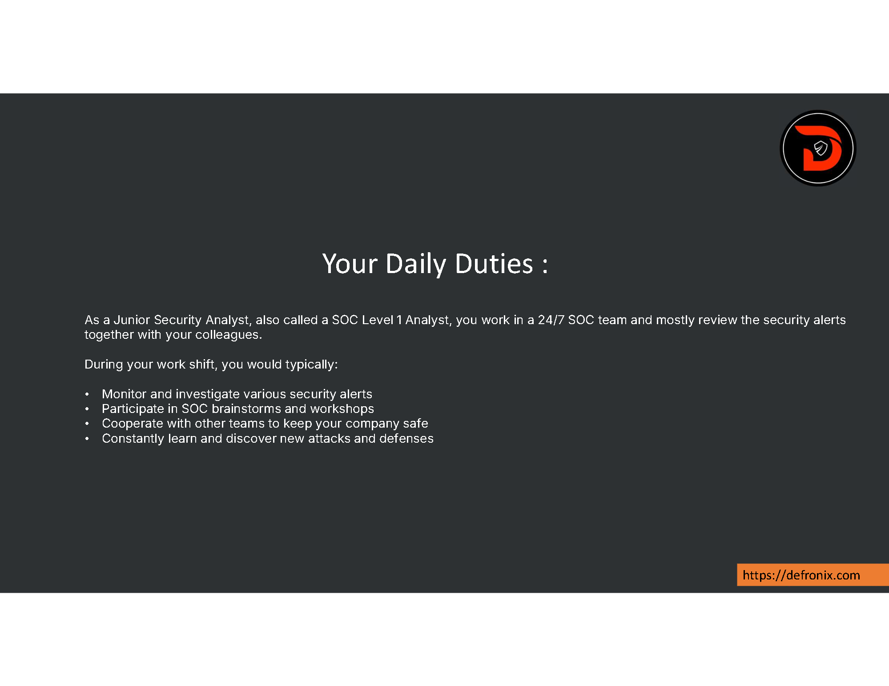
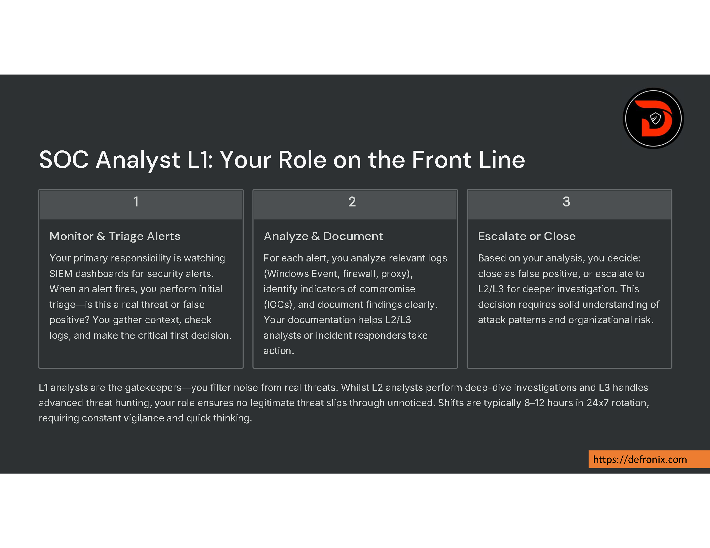
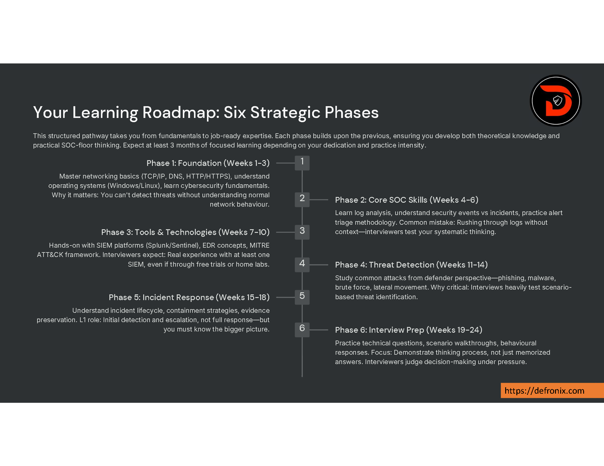
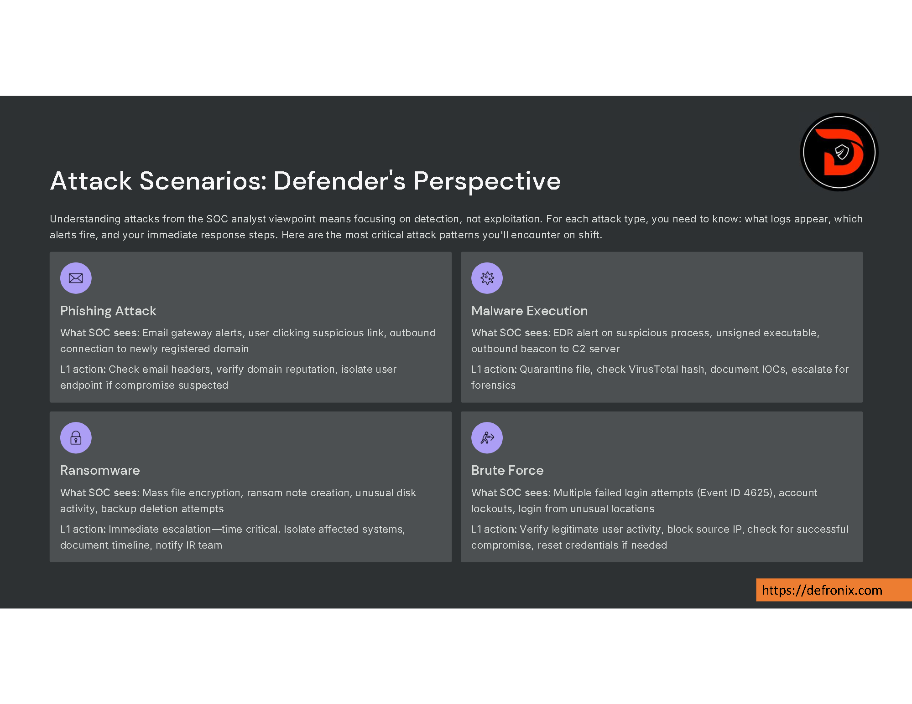
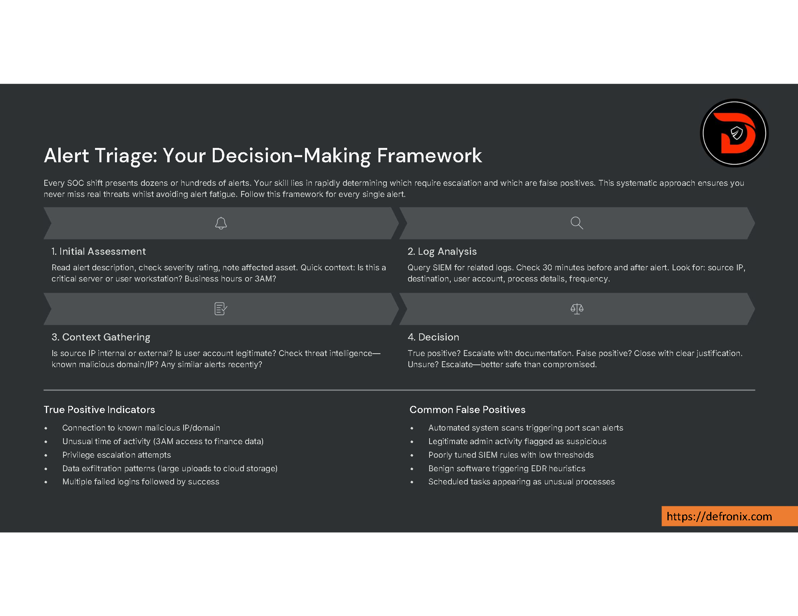
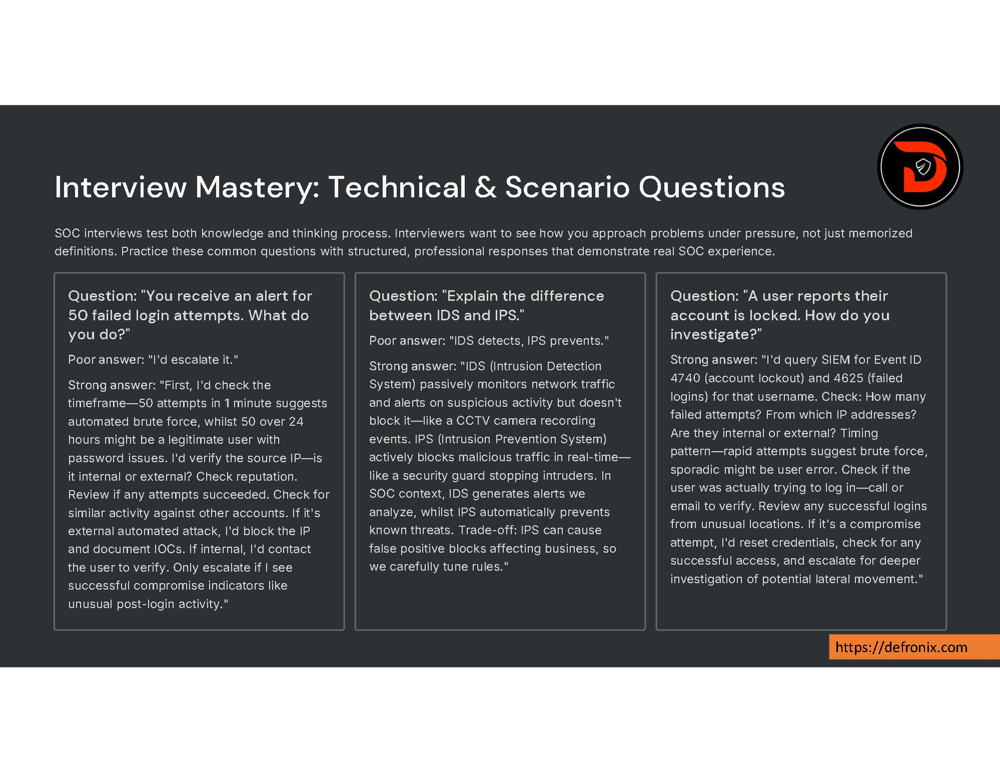
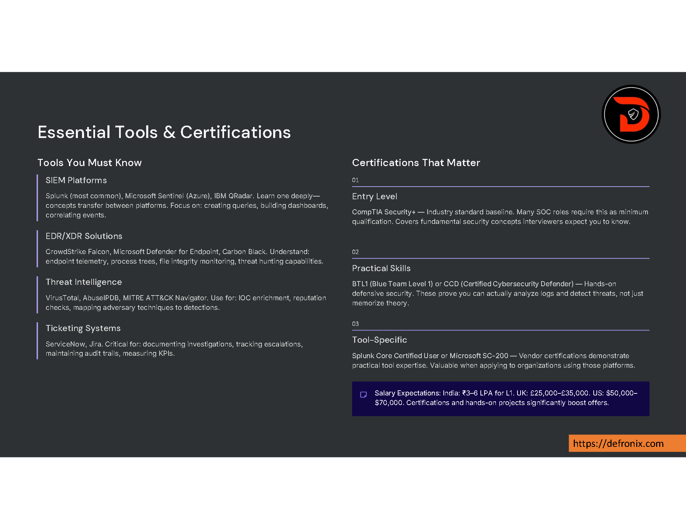
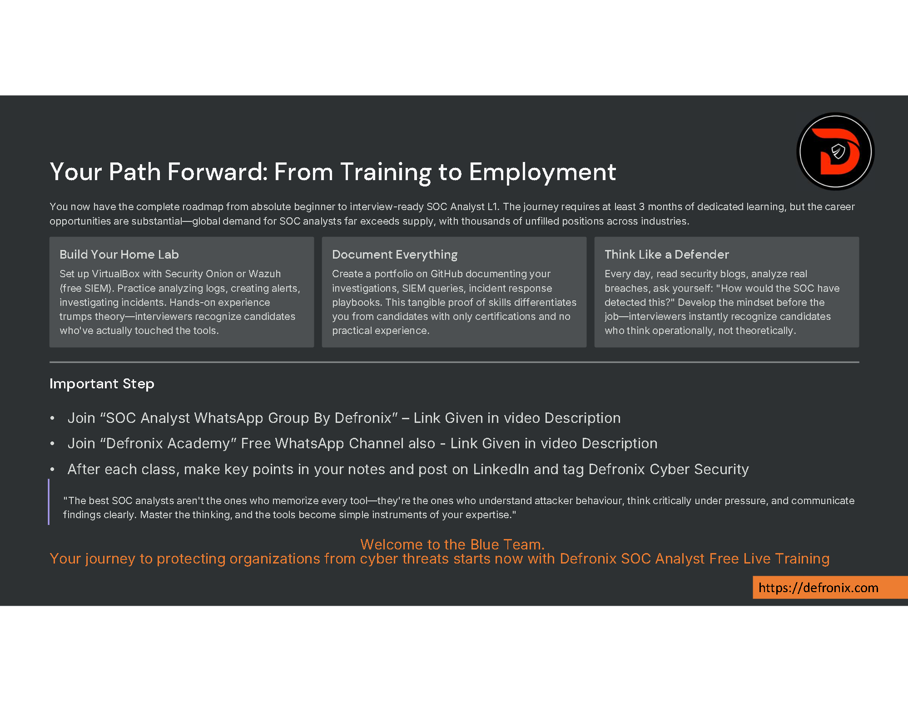

# Here is Days - 1

Day- notes 

---

| #  | Preview                                   | Description                                                        |
|----|-------------------------------------------|--------------------------------------------------------------------|
| 1  |       | From Zero to SOC Analyst L1 - Your Complete Training Programme.    |  
| 2  |       | Why SOC Exists: The Digital Battlefield                            |
| 3  |       | Your Daily Duties :                                                |
| 4  |       | SOC Analyst L1: Your Role on the Front Line                        |
| 5  |       | Your Learning Roadmap: Six Strategic Phases                        |
| 6  |       | Attack Scenarios: Defender's Perspective                           |
| 7  |       | Alert Triage: Your Decision-Making Framework                       |
| 8  |       | Interview Mastery: Technical & Scenario Questions                  |
| 9  |       | Essential Tools & Certifications                                   |
| 10 |     | Your Path Forward: From Training to Employment                     |

---

