# Here is Days -8

Day- notes 

---

| #  | Preview                                   | Description |
|----|-------------------------------------------|------------------------------|
| 1  | 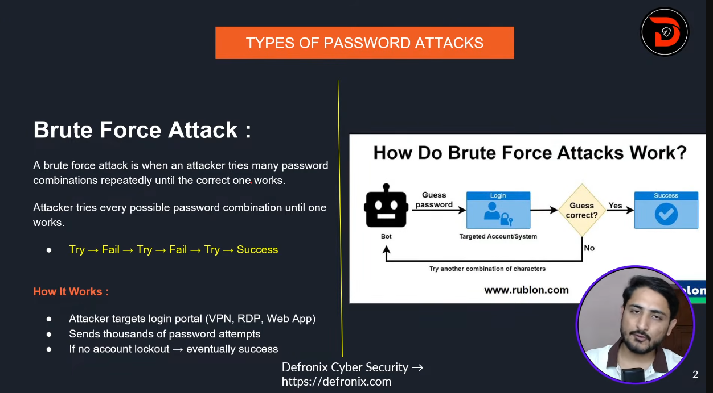   | TYPES OF PASSWORD ATTACKS      |
| 2  | 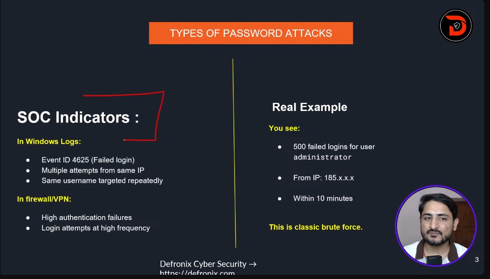   | TYPES OF PASSWORD ATTACKS      |
| 3  |    | TYPES OF BRUTE FORCE ATTACKS   |
| 4 |    | Reverse Bruteforce Attack       | 
| 5|    | Dictionary Attack                |
| 6 | 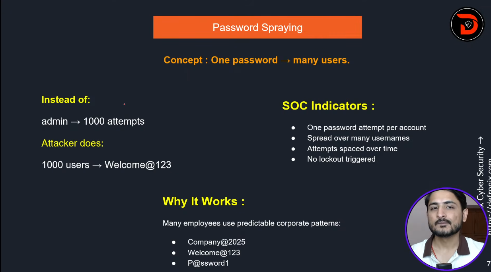   | Password Spraying               |
| 7 | 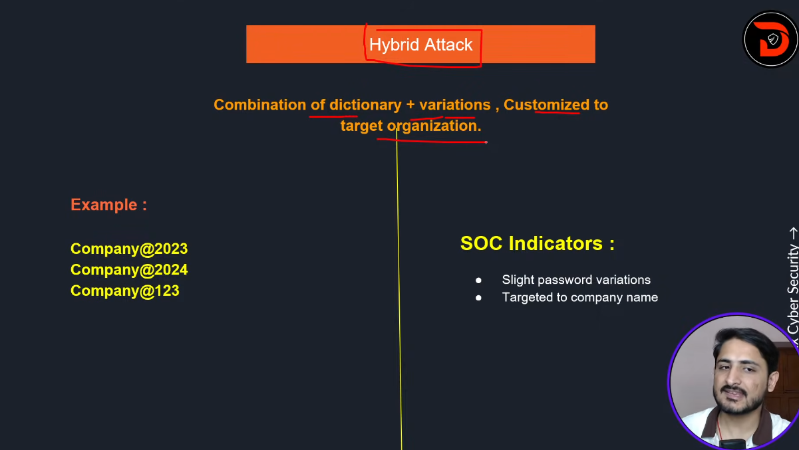   | Hybrid Attack                   |
| 8 | 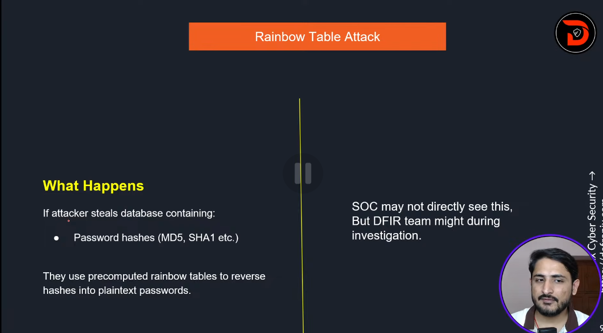   | Rainbow Table attack            |
| 9 | 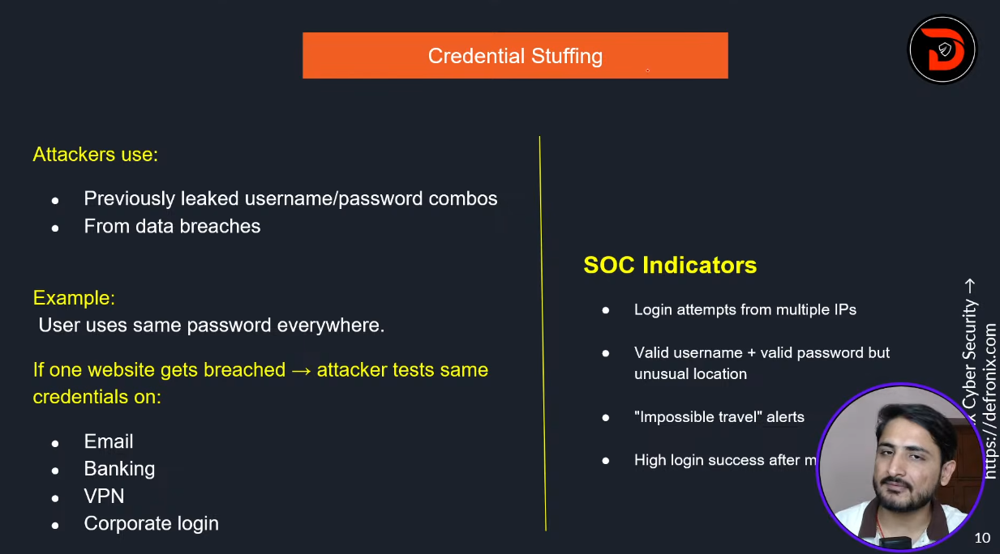   | Credential Stuffing             |
| 10 | 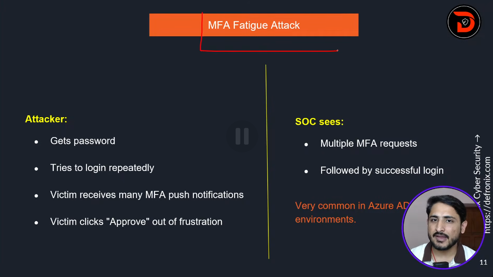   | MFA Fatigue Attack            |
| 11 | 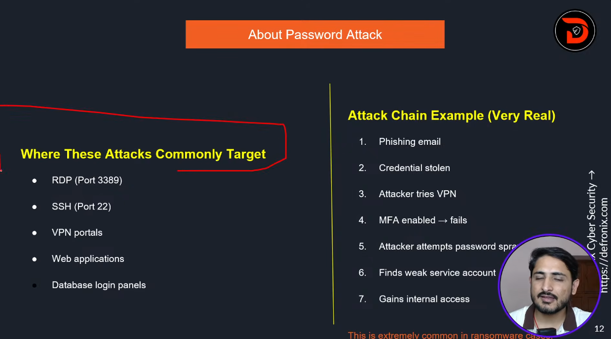   | About Password Attack         |
| 12 | 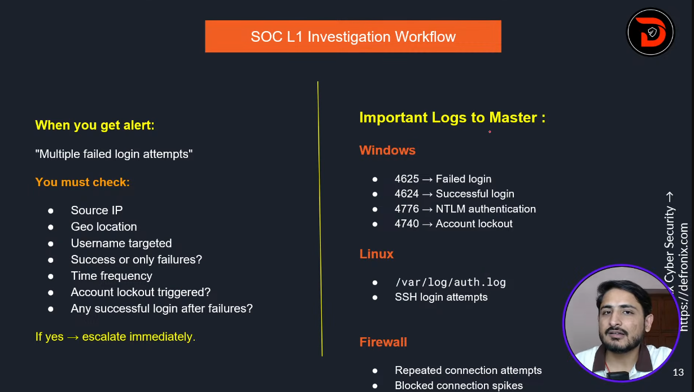   | SOC L1 Investigation Workflow |
| 13 | 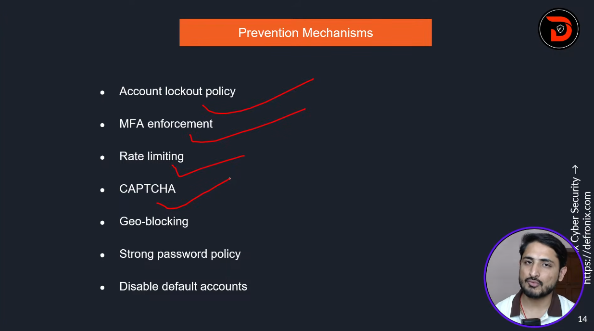   | Prevention Mechanisms         |
| 14 | 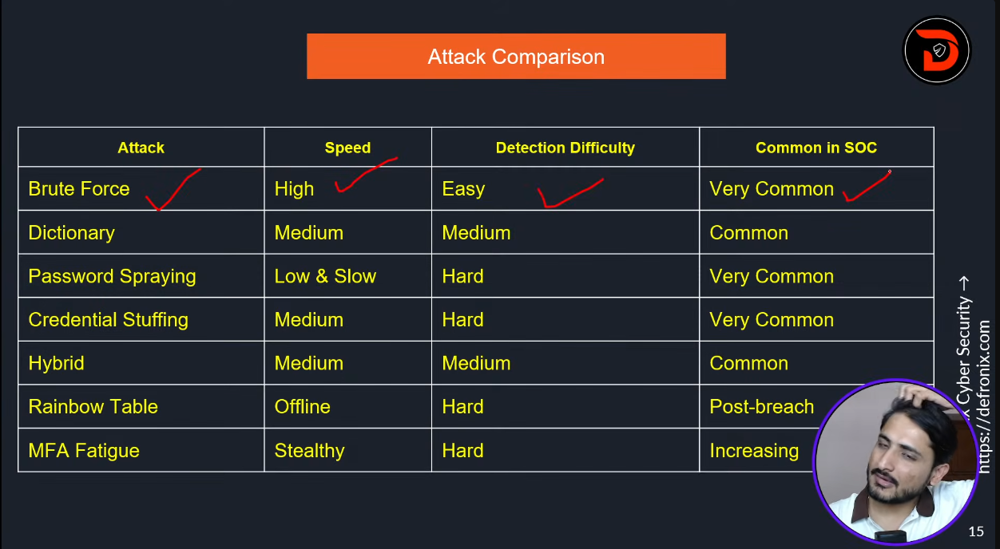   | Attack Comparison             |
| 15 |    | About Password Attack         |

---

