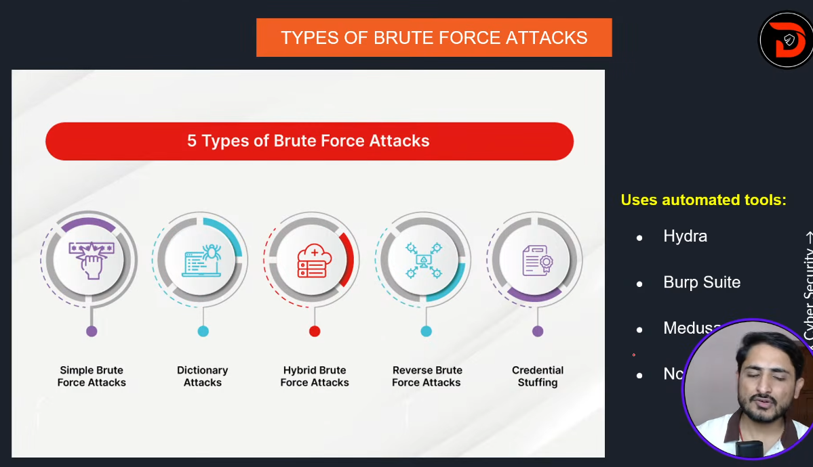
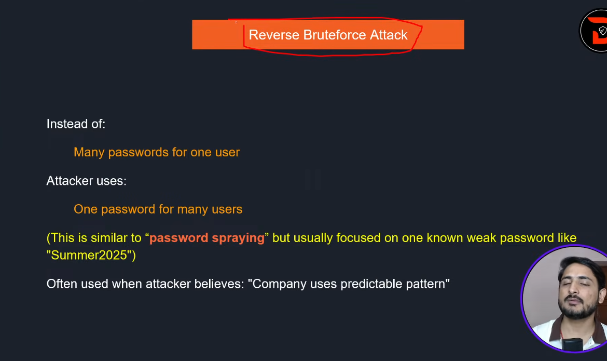
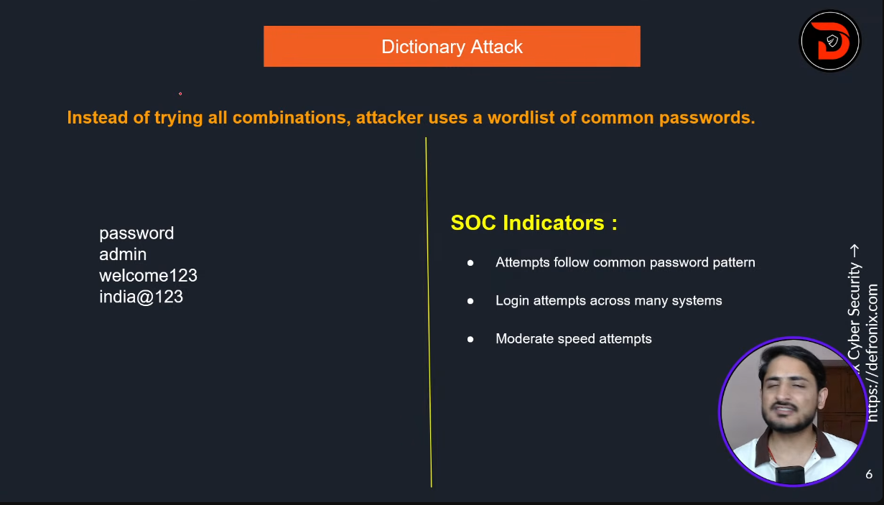

# Here is Days -4

Day- notes 

---

 #  | Preview                              | Description                              |
|----|--------------------------------------|------------------------------------------|
| 1  |    | TYPES OF PASSWORD ATTACKS
| 2  |    | TYPES OF PASSWORD ATTACKS |
| 3  |    | TYPES OF BRUTE FORCE ATTACKS |
| 4 |    | Reverse Bruteforce Attack | 
| 5|    | Phishing & Social Engineering             |
| 6 |    | Phishing & Social Engineering             |
| 7 |    | Phishing & Social Engineering             |

---

